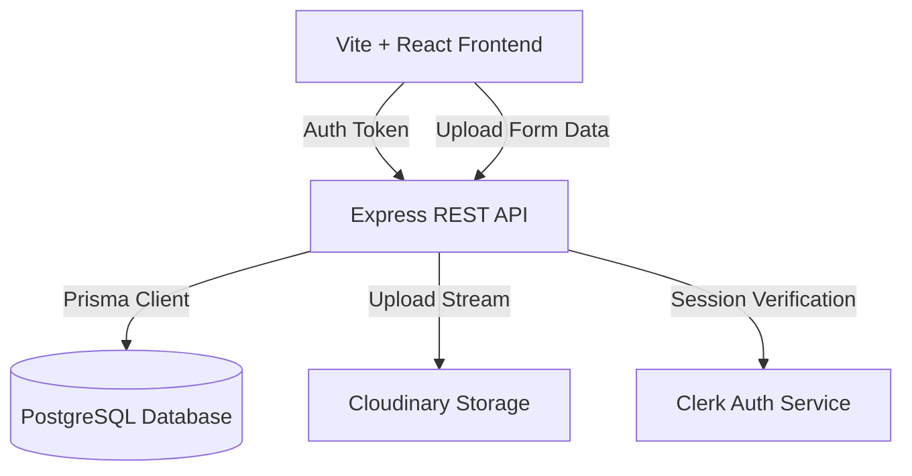

# InteriorAI Studio - Production Architecture Documentation

This project has been refactored from a static frontend demo into a production-ready, backend-driven application with Clerk authentication, a PostgreSQL database, Cloudinary uploads, and an API-driven branching version tree.

## Technical Architecture Overview

The system is split into a client-server architecture:



---

## 1. Database Selection & Justification

### Selected Database: **PostgreSQL**
We selected PostgreSQL over MongoDB for the following architectural reasons:

1. **Tree Representation & Traversal (Recursive CTEs)**: The version history is represented as a branching tree (each child node branches from a parent). PostgreSQL natively supports **Recursive Common Table Expressions (CTEs)**. This allows the API to fetch the entire tree of variations for a project and calculate their positioning coordinates in a single database query.
2. **Referential Integrity**: An AI version tree is sensitive to orphaned nodes. If a parent generation is deleted, all child branches originating from it must either be cleaned up or cascade deleted. PostgreSQL enforces strict foreign keys (`ON DELETE CASCADE`), ensuring database-level tree integrity.
3. **Collaboration & Relational Extensions**: In future phases, adding workspace permissions, user-to-project sharing, credits, invoicing, and node-level comment threads maps directly to SQL join tables (e.g. `comments`, `transactions`, `user_permissions`).

### Database Schema (Prisma ORM)

The database schema is structured as follows:

- **User**: Stores basic Clerk profile mappings (`id` matches the Clerk `userId`).
- **Project**: Represents a design project workspace containing multiple generations.
- **Generation**: The core entity. Uses a self-referential `parentId` foreign key pointing back to `Generation` to form the branching version history. It stores prompt details, preset selections, coordinates (`x`, `y`), and status ("pending", "completed").

---

## 2. Express Backend Architecture (`/backend`)

The backend is built using Node.js, Express, and TypeScript, following a clean layer structure:

```
backend/
├── prisma/
│   └── schema.prisma       # Database models & relationships
├── src/
│   ├── config/             # Third-party configurations (db, cloudinary)
│   ├── controllers/        # Express request handlers & validation
│   ├── middleware/         # Auth, cors, and centralized error handling
│   ├── routes/             # Endpoint routing & Zod validation
│   ├── app.ts              # Express app initialization
│   └── server.ts           # Bootstrapper verifying db connection
```

### Key Integrations:
- **Clerk JWT Verification**: Authenticated routes use the `@clerk/express` middleware to verify Bearer tokens. A custom synchronization middleware intercepts verified requests, automatically registering or updating the user's profile in the PostgreSQL database.
- **Cloudinary Stream Uploads**: Multiprocess files uploaded through `/api/uploads` are stored in memory using `multer` and streamed directly to Cloudinary. This ensures the backend remains stateless, secure, and ready for serverless scaling.
- **Mock AI Pipeline**: The generation endpoint creates a `pending` generation, sleeps for 2 seconds to simulate GPU inference latency, updates the status to `completed` with a preset-matching Unsplash layout URL, and returns the finished node.

---

## 3. Frontend Architecture Refactoring (`/src`)

The frontend has been refactored into a **4-Layer Architecture**:

1. **API Client Layer (`src/api/`)**: Houses raw, type-safe API requests (using vanilla `fetch`). Automatically attaches the Clerk session token to all HTTP `Authorization` headers.
2. **Service Layer (`src/services/`)**: Implements business services wrapping API operations, keeping API schemas separated from UI components.
3. **Hooks Layer (`src/hooks/`)**: Implements custom hooks utilizing **TanStack Query (React Query)** to handle query cache keys, mutations, status states (loading, error), and reactive cache invalidation (e.g., refetching the tree when a generation completes).
4. **View Layer (`src/pages/`, `src/components/`)**: Clean components that consume hooks, fully separated from direct fetch operations.

### Key Refactor Updates:
- **Project-Aware Studio Page (`/project/:projectId`)**: StudioPage is fully dynamic. It loads project details, fetches version tree coordinates, and adapts based on the active path parameter.
- **Empty Project State**: If a project has no versions, the workspace displays a premium glassmorphic drag-and-drop card prompting the user to upload their first base room photo. This uploads to Cloudinary and generates the original base node (`v1`) automatically.
- **Dynamic Branching**: When clicking a node, a `v-placeholder` child is dynamically computed and attached to it on the canvas, allowing the user to branch a new design from any past iteration.

---

## 4. How to Run Locally

### Prerequisites
- Node.js (v18+)
- A running PostgreSQL database instance
- A Clerk account
- A Cloudinary account

### Step 1: Clone and Configure Environment

1. Copy the backend template env:
   ```bash
   cp backend/.env.example backend/.env
   ```
   Fill in your `DATABASE_URL`, `CLERK_SECRET_KEY`, and `CLOUDINARY_` secrets.

2. Create a frontend env file (`.env` in root):
   ```
   VITE_CLERK_PUBLISHABLE_KEY=pk_test_your_clerk_key
   VITE_API_BASE_URL=http://localhost:5000/api
   ```

### Step 2: Start the Backend

1. Navigate to `/backend` and install dependencies:
   ```bash
   cd backend
   npm install
   ```
2. Generate Prisma Client and apply migrations:
   ```bash
   npx prisma generate
   # Run this once your PostgreSQL connection string is set:
   npx prisma db push
   ```
3. Spin up the dev server:
   ```bash
   npm run dev
   ```
   The API will listen on [http://localhost:5000](http://localhost:5000).

### Step 3: Start the Frontend

1. Navigate back to the root directory and install dependencies:
   ```bash
   cd ..
   npm install
   ```
2. Spin up the Vite dev server:
   ```bash
   npm run dev
   ```
   The client will open on [http://localhost:5173](http://localhost:5173).
